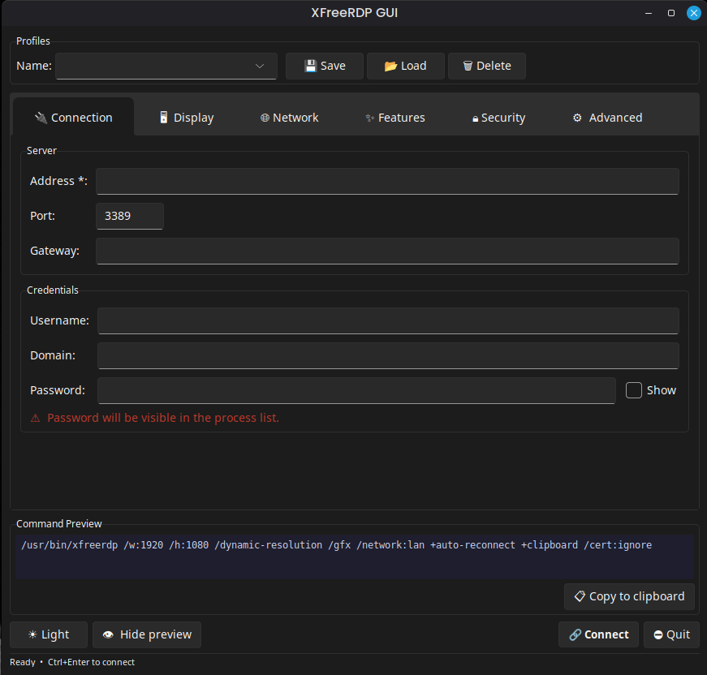

#  XFreeRDP GUI

A graphical frontend for [FreeRDP](https://www.freerdp.com/) on Linux. Build and launch `xfreerdp` connections through a point-and-click interface — no need to remember command-line flags.



---

## Features

- Save and load named connection profiles
- Configure resolution, color depth, and rendering options
- Network quality presets and auto-reconnect settings
- Device redirection: clipboard, audio, microphone, printer, USB, drives
- Remote App (`/app:`) support
- Certificate and security protocol options
- Advanced flags: custom FreeRDP arguments, `/admin`, KeepAlive, etc.
- Live command preview showing the exact `xfreerdp` command that will be run
- Dark / Light theme toggle (uses [sv-ttk](https://github.com/rdbende/Sun-Valley-ttk-theme) when available)

---

## Requirements

| Requirement | Notes |
|---|---|
| **Linux** (Debian/Ubuntu/Fedora/Arch or compatible) | Tested on Ubuntu 22.04+ |
| **Python 3.10+** | `python3 --version` to check |
| **python3-tk** | Tkinter GUI toolkit |
| **xfreerdp** (FreeRDP 2.x or 3.x) | The underlying RDP client |

---

## Installation

### 1. Install system dependencies

**Debian / Ubuntu / Linux Mint**
```bash
sudo apt update
sudo apt install python3 python3-tk freerdp2-x11
```

> For FreeRDP 3.x (where available):
> ```bash
> sudo apt install freerdp3-x11
> ```

**Fedora / RHEL / CentOS Stream**
```bash
sudo dnf install python3 python3-tkinter freerdp
```

**Arch Linux / Manjaro**
```bash
sudo pacman -S python tk freerdp
```

**openSUSE**
```bash
sudo zypper install python3 python3-tk freerdp
```

---

### 2. Clone the repository

```bash
git clone https://github.com/your-username/XFreeRDP.git
cd XFreeRDP
```

> Replace the URL with the actual repository URL if different.

---

### 3. (Optional but recommended) Create a virtual environment

```bash
python3 -m venv .venv
source .venv/bin/activate
```

---

### 4. (Optional) Install the sv-ttk theme

The Sun Valley theme provides a polished Windows 11-style appearance. The app works without it, falling back to a built-in dark/light theme.

```bash
pip install sv-ttk
```

---

### 5. Make the launcher script executable

```bash
chmod +x run.sh
```

---

### 6. Run the application

```bash
./run.sh
```

Or directly with Python:

```bash
python3 main.py
```

---

## Build an AppImage

This repository includes a build script that packages the app as a single `.AppImage`.

### Requirements for AppImage build

- `python3` and `pip`
- `appimagetool` (from AppImageKit releases)

Install build-only Python dependency:

```bash
python3 -m pip install --user pyinstaller
```

Ensure `appimagetool` is available:

```bash
appimagetool --version
```

### Build command

```bash
chmod +x scripts/build_appimage.sh
./scripts/build_appimage.sh
```

Output file:

```bash
build/appimage/XFreeRDP-GUI-<arch>.AppImage
```

Notes:

- The AppImage bundles your GUI app runtime.
- `xfreerdp` itself is still expected on the target Linux system (`xfreerdp` in `PATH`).

---

## (Optional) Add to the application menu

To make XFreeRDP GUI appear in your desktop application launcher, install the `.desktop` file:

```bash
# Edit the Exec and Icon paths to match your actual install location
sed -i "s|/home/taufiq/RiderProjects/XFreeRDP|$(pwd)|g" xfreerdp-gui.desktop

# Install for the current user
cp xfreerdp-gui.desktop ~/.local/share/applications/

# Refresh the desktop database (usually automatic, but run if the entry doesn't appear)
update-desktop-database ~/.local/share/applications/
```

---

## Configuration

Profiles and settings are stored in `~/.config/xfreerdp-gui/`:

| File | Contents |
|---|---|
| `profiles.json` | All saved connection profiles |
| `settings.json` | UI preferences (e.g. dark mode) |

These files are created automatically on first run.

---

## Keyboard Shortcuts

| Shortcut | Action |
|---|---|
| `Ctrl+Enter` | Connect |
| `Ctrl+S` | Save current profile |

---

## Uninstall

1. Remove the application files:
   ```bash
   rm -rf /path/to/XFreeRDP
   ```

2. Remove the desktop entry (if installed):
   ```bash
   rm ~/.local/share/applications/xfreerdp-gui.desktop
   ```

3. Remove saved profiles and settings:
   ```bash
   rm -rf ~/.config/xfreerdp-gui
   ```

---

## Troubleshooting

**`python3-tk is not installed` error**
Install Tkinter for your distribution (see step 1 above) and re-run.

**`xfreerdp: command not found`**
Install FreeRDP (see step 1 above). Verify with `xfreerdp --version`.

**Window icon is missing**
The icon is generated from `icon.svg` at startup. Install one of the following converters and restart:
```bash
sudo apt install librsvg2-bin   # provides rsvg-convert (recommended)
# or
sudo apt install imagemagick    # provides convert
# or
sudo apt install inkscape
```

**Theme looks plain / no Sun Valley theme**
Install sv-ttk inside your virtual environment:
```bash
source .venv/bin/activate
pip install sv-ttk
```

---

## License

This project is provided as-is. See the repository for license details.
